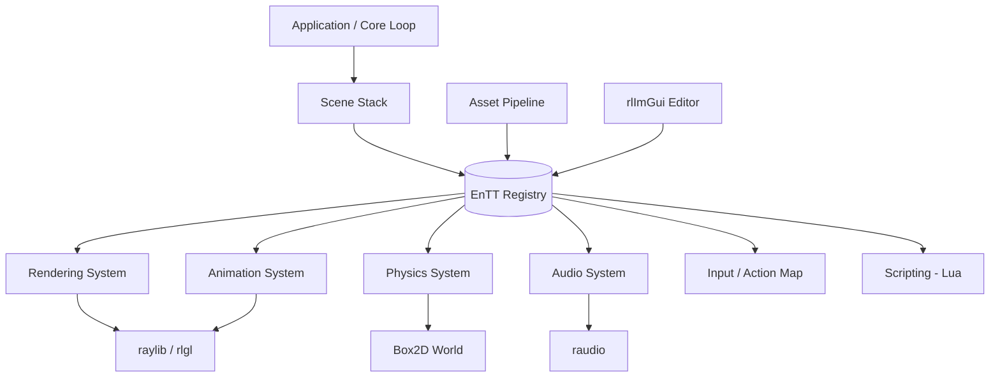

# 2D C++ Engine Build Plan — Raylib Foundation

*Research + architecture plan compiled Aug 30, 2026. Versions below were current as of this date — raylib in particular ships fast, so check each project's release page before committing to Phase 0.*

## 0. Where this sits

This is a separate, lighter sibling to ICUX Engine, not a replacement for it — ICUX is your C++20/Vulkan (OpenGL 4.6 fallback) engine with GPU-compute skeletal animation; this trades that low-level GPU control for raylib's batteries-included platform layer, in exchange for shipping an actual 2D game much faster. And since HackMeArena already got you through raylib's basics in a single-file project, this skips the "what is raylib" material and goes straight into structuring it like a real engine instead of a jam entry.

## 1. Scope: what "AAA-level" means here

Worth being direct about up front: raylib itself is a lean platform layer — window/context, input, 2D/3D drawing primitives, audio, a pseudo-OpenGL-1.1 immediate-mode renderer (`rlgl`) underneath. It explicitly bills itself as "no fancy interface, no auto-debugging," and most of what's shipped with it (see [raylib's own games page](https://www.raylib.com/games.html) and its [itch.io tag](https://itch.io/games/made-with-raylib)) is jam-to-indie scale — a few have shipped commercially (e.g. *DungeonOS* on Steam), but raylib isn't handing you AAA production values for free.

What actually gets you there is what's built on top: a real ECS instead of ad hoc structs, a proper animation/content pipeline instead of hand-typed frame rectangles, physics you don't roll yourself, in-engine editor tooling instead of recompiling to move a spawn point, and a deliberate "game feel" pass. That's the target this plan is built around — the same documentation-first rigor you've been applying to ICUX Engine, aimed at a 2D-scoped, much-faster-to-ship stack.

## 2. Stack at a glance

| Layer | Library | License | Role |
|---|---|---|---|
| Platform / rendering / audio | [raylib 6.0](https://www.raylib.com/) ([GitHub](https://github.com/raysan5/raylib)) | zlib | Window, input, 2D/3D drawing, `raudio`, `rlgl` |
| C++ ergonomics (optional) | [raylib-cpp](https://github.com/RobLoach/raylib-cpp) / [raylib-cpp20](https://github.com/furudbat/raylib-cpp20) | zlib | RAII/OOP wrappers over raylib's C structs |
| ECS | [EnTT](https://github.com/skypjack/entt) | MIT | Sparse-set ECS; used in Minecraft (Bedrock), Esri's ArcGIS Runtime |
| Physics | [Box2D v3.1](https://github.com/erincatto/box2d) | MIT | 2D rigid-body physics, C API with ID handles |
| Scripting | [sol2 / sol3](https://github.com/ThePhD/sol2) | MIT | Type-safe Lua ⇄ C++ binding |
| Editor UI | [Dear ImGui](https://github.com/ocornut/imgui) + [rlImGui](https://github.com/raylib-extras/rlImGui) | MIT / zlib | Immediate-mode debug & editor tooling |
| In-game UI | [raygui](https://github.com/raysan5/raygui) | zlib | Lightweight IMGUI-style shipped UI |
| Sprite animation | [raylib-aseprite](https://github.com/RobLoach/raylib-aseprite) (built on [cute_aseprite](https://github.com/RandyGaul/cute_headers)) | zlib | Loads `.aseprite` files with named tags directly — no export step |
| Tilemaps / misc | [cute_headers](https://github.com/RandyGaul/cute_headers) (`cute_tiled`, `cute_spritebatch`, `cute_sound`, `cute_png`) | permissive (see header) | Single-file, dependency-free helpers |
| Serialization | [nlohmann/json](https://github.com/nlohmann/json) | MIT | Config, save data, scene/level files |
| Profiling | [Tracy](https://github.com/wolfpld/tracy) | BSD-3-Clause | Nanosecond frame profiler, CPU + GPU |
| Networking (stretch) | [ENet](https://enet.bespin.org/) | MIT-style | Thin reliable-UDP layer, no built-in auth/lobby |
| Advanced 2D rigs (stretch) | [Spine](https://esotericsoftware.com/) (commercial) / [DragonBones](https://dragonbones.github.io/) (free) | commercial / MIT | Bone-based deformation beyond frame sprites |

On raylib-cpp: raylib is C99 and includes cleanly in C++ as-is, so it's fine to start with the raw API and add raylib-cpp later only if manually calling `Unload*()` everywhere gets tedious — it's a thin, incrementally-adoptable layer, not an all-or-nothing choice. Given you're targeting C++20 on ICUX, `raylib-cpp20` (a C++20-idiomatic fork) is worth a look over the original.

## 3. High-level architecture



Everything hangs off an EnTT `registry`. Systems are plain functions (or small structs) that take the registry plus a timestep and mutate components — no inheritance hierarchies, no `GameObject` base class.

## 4. Suggested project layout

```
engine/
├── CMakeLists.txt
├── third_party/           # FetchContent cache or vendored single-headers
├── assets/
│   ├── sprites/            # .aseprite source files
│   ├── maps/                # Tiled .tmx / .json
│   ├── audio/
│   └── scripts/               # .lua
├── src/
│   ├── core/                  # Application, timestep, logging
│   ├── ecs/                   # Components, systems
│   ├── render/                # Camera, sprite batch, shaders
│   ├── animation/
│   ├── physics/
│   ├── audio/
│   ├── input/
│   ├── ui/                     # editor + in-game
│   ├── scripting/
│   ├── serialization/
│   └── main.cpp
├── editor/                    # ImGui panels, only linked in dev builds
└── tools/                       # asset packers, hot-reload shim
```

## 5. Core loop

Fixed-timestep update with variable-rate render + interpolation is the standard pattern once physics is involved — it decouples simulation determinism from frame rate:

```cpp
const float dt = 1.0f / 60.0f;
float accumulator = 0.0f;

while (!WindowShouldClose()) {
    accumulator += GetFrameTime();
    while (accumulator >= dt) {
        FixedUpdate(registry, dt);   // physics, gameplay logic
        accumulator -= dt;
    }
    float alpha = accumulator / dt;
    BeginDrawing();
        Render(registry, alpha);      // interpolate positions using alpha
    EndDrawing();
}
```

## 6. ECS (EnTT)

- Requires C++17+ — no friction against your existing C++20 target.
- Header-only: `#include <entt/entt.hpp>`.
- Starter components: `Transform2D{ position, rotation, scale }`, `Sprite{ texture, sourceRect, layer }`, `AnimationPlayer`, `RigidBody2D{ b2BodyId }`, `Velocity`, `Tag`.
- EnTT ships its own snapshot/serialization API (`entt::snapshot` / `snapshot_loader`) — use it for entity save/load instead of hand-rolling it (see §15).
- Pin a release tag rather than `master`; check the [releases page](https://github.com/skypjack/entt/releases) for the current one.

## 7. Rendering & camera

- `Camera2D` (target, offset, rotation, zoom) is built into raylib — wrap it with a "follow target with smoothing/deadzone" helper.
- Sprites: `DrawTexturePro()` with a source `Rectangle` into an atlas — this is what makes sprite-sheet animation and 9-slicing essentially free.
- **Batching**: `rlgl` accumulates vertices into a buffer and only issues a real draw call when the texture, shader, or draw mode changes (or the buffer fills). Practically: keep each character/tileset in one atlas, draw same-texture sprites back-to-back, and verify actual batching with RenderDoc — there are occasional reports ([raylib#4849](https://github.com/raysan5/raylib/issues/4849)) of unexpected per-draw texture rebinds worth ruling out on your own hardware.
- Layers/z-order: sort by a `layer` field, then by `y` for pseudo-depth in top-down/platformer scenes, before submitting draws.
- Post-processing: two `RenderTexture2D` targets (scene → effect → screen) gets you bloom, color grading, vignette, chromatic aberration; screen shake is just offsetting the camera, not the world.
- 2D lighting: raylib's official shader examples target 3D Phong-style lighting. For 2D, the established technique is a full-screen shader pass over a darkness overlay with light positions/radii as uniforms ([worked example](https://bedroomcoders.co.uk/posts/186)) — optionally combined with per-sprite normal maps for finer per-pixel response.

## 8. Sprite animation system (the part you specifically flagged)

Two layers:

**Content pipeline — Aseprite as source of truth.** Aseprite is the de facto standard for 2D sprite animation. `raylib-aseprite` loads `.aseprite`/`.ase` files straight into raylib with named tags, no manual JSON export or re-slicing when the artist adds a frame:

```cpp
Aseprite hero = LoadAseprite("assets/sprites/hero.aseprite");
AsepriteTag walk = LoadAsepriteTag(hero, "Walk");
walk.speed = 1.0f;
UpdateAsepriteTag(&walk);            // advances the frame each tick
DrawAseprite(hero, walk, {x, y}, WHITE);
```

**Runtime layer — your own `AnimationClip` / `AnimationPlayer`.** Wrap the loaded tag data in your own components so gameplay code never touches Aseprite types directly:
- `AnimationClip{ name, frames[], loop, onComplete → nextClip }`
- `AnimationPlayer{ currentClip, frameIndex, elapsed, playbackSpeed }`
- Frame-indexed events (e.g. "footstep sound on frame 3") — a sparse map on the clip, fired by the animation system when `frameIndex` changes.
- A small state machine on top (idle → walk → attack), driven by gameplay flags rather than raw input, keeps animation decoupled from control code.

If you outgrow frame-by-frame sprites — want stretch/squash mesh deformation on a hand-authored rig — that's a separate tier (Spine or DragonBones, §20), not something to bolt onto this system later. Decide early if you need it; it changes the art pipeline.

## 9. Physics (Box2D v3.1)

- v3 is a full rewrite in C: no classes, IDs instead of pointers (`b2BodyId`, `b2ShapeId`), optional C++ math operator overloads. MIT-licensed.
- Erin Catto (Box2D's author) maintains a [reference raylib integration](https://github.com/erincatto/box2d-raylib) using plain CMake `FetchContent` with no submodules or file-copying — read it before writing your own glue.
- Pattern: a `RigidBody2D` component storing a `b2BodyId`; one system steps the Box2D world per fixed update, a second copies the resulting transform back into `Transform2D` for rendering.
- Collision → gameplay: consume Box2D's contact/sensor events and translate them into your own ECS-level events rather than letting gameplay code touch Box2D types directly — keeps physics swappable later.

## 10. Audio

raylib's `raudio` module covers this without another dependency: `LoadSound`/`PlaySound` for one-shots, `LoadMusicStream`/`UpdateMusicStream` for streamed music (OGG/MP3/FLAC/WAV, from file or memory). Build three thin volume "buses" (master/SFX/music) as multipliers over raylib's per-instance volume calls, plus a small SFX-pool wrapper for overlapping instances of the same sound (footsteps, gunfire).

## 11. Input

Raw raylib input (`IsKeyDown`, `IsGamepadButtonPressed`, `GetGamepadAxisMovement`) is fine to call directly, but wrap it behind an action-mapping layer from day one — `InputAction::Jump` bound to `{Space, Gamepad South}` — so rebinding and multiple devices don't mean hunting down raw key checks later. Platformer-feel polish items that belong in this layer: input buffering (accept a jump press a few frames before landing) and coyote time (allow jump a few frames after leaving a ledge).

## 12. UI: editor tooling vs. shipped UI

Two different problems, two different libraries:

- **Editor/debug** — rlImGui + Dear ImGui. `rlImGuiSetup()` / `rlImGuiBegin()` / `rlImGuiEnd()` / `rlImGuiShutdown()` around your existing raylib loop, ordinary ImGui calls in between. rlImGui's own repo builds via Premake, not CMake — either vendor its handful of files directly into your target (it's small) or use a community CMake fork. Tag your rlImGui/ImGui checkout to match your raylib version — the raylib-extras repo tags releases per raylib version (their `Raylib_6_0` branch currently pairs with ImGui 1.92.7).
- **Shipped in-game UI** — raygui (menus, HUD, dialogs), or a custom lightweight retained-mode layer if raygui's default look doesn't fit your art direction. Compile the editor UI out of release builds behind an `EDITOR_BUILD` flag.

## 13. Scripting (optional, but a strong fit for "AAA" iteration speed)

Hard-coding all gameplay logic in C++ means a recompile per tuning pass. sol2/sol3 (MIT, header-only) gives type-safe Lua bindings without hand-rolling stack manipulation:

```cpp
sol::state lua;
lua.open_libraries(sol::lib::base, sol::lib::math);
lua.new_usertype<Transform2D>("Transform2D",
    "x", &Transform2D::x, "y", &Transform2D::y);
lua.script_file("assets/scripts/enemy_ai.lua");
```

Bind ECS accessors (spawn entity, get/set component, play animation) as the only surface Lua scripts touch — keep it narrow so runtime script hot-reload doesn't require the engine to know anything about specific gameplay logic. If sol2 feels heavier than you want, [LuaBridge3](https://kunitoki.github.io/LuaBridge3/Manual) is a smaller, dependency-free alternative with less compile-time cost.

## 14. Asset pipeline & resource management

- A `ResourceManager<T>` (texture, sound, aseprite, font) handing out shared handles keyed by path, so the same texture loaded from two places is one GPU upload.
- Hot-reload assets in dev builds: watch file mtimes and re-`Load*()` on change — a large iteration-speed win, standard in serious 2D engines.
- Tilemaps: author in [Tiled](https://www.mapeditor.org/), parse with `cute_tiled` (part of cute_headers) — an efficient JSON-format loader, no dependency beyond the one header.

## 15. Serialization & save system

nlohmann/json (MIT, header-only, `NLOHMANN_DEFINE_TYPE_*` macros for near-free struct ⇄ JSON) for config, level/scene data, and save files. For full entity-state serialization (actual game state, not just authored level data), use EnTT's own snapshot API rather than writing per-component JSON glue — it's built for exactly this.

## 16. Tooling

- **Hot-reload of game code**: build gameplay as a separate shared library (`.dll`/`.so`) that the engine loads and can unload/reload at runtime while keeping the window and ECS state resident — the classic Handmade-Hero-style pattern. Non-trivial but transformative for iteration speed; treat as a stretch goal, not a Phase-1 requirement.
- **Level editor**: cheapest path is Tiled for tilemaps/layout plus your own ImGui panels for engine-specific data (spawn points, triggers, entity properties), rather than a full custom editor from scratch.
- **Profiling**: Tracy — `ZoneScoped` macro instrumentation, near-zero overhead with no client attached (`TRACY_ON_DEMAND`), profiles CPU, GPU (OpenGL included), memory, and locks in one timeline. Worth wiring in from Phase 1 rather than bolting on later.

## 17. Build system & platforms

- CMake + `FetchContent` is the de facto standard for modern raylib projects — pulls raylib, EnTT, Box2D, and nlohmann/json straight from GitHub at configure time, no submodules or system packages. Skeleton below.
- Primary target: Windows — your RTX 2080 Ti comfortably runs GLSL 330, no need to drop to raylib's GLES fallback path. Given your Fedora/KDE background, keep Linux in CI even with Windows primary; raylib's cross-platform story makes this close to free as long as you avoid OS-specific code paths.
- Web: raylib 6.0 added an experimental Emscripten platform backend on top of the existing, well-trodden `emcc -DPLATFORM=Web` export path — a reasonable way to ship a browser demo build later.

```cmake
cmake_minimum_required(VERSION 3.20)
project(MyEngine CXX)
set(CMAKE_CXX_STANDARD 20)
set(CMAKE_CXX_STANDARD_REQUIRED ON)

include(FetchContent)
set(FETCHCONTENT_QUIET FALSE)
set(BUILD_EXAMPLES OFF CACHE BOOL "" FORCE)

FetchContent_Declare(raylib GIT_REPOSITORY https://github.com/raysan5/raylib.git GIT_TAG 6.0)
FetchContent_Declare(entt   GIT_REPOSITORY https://github.com/skypjack/entt.git   GIT_TAG master) # pin to a release tag
FetchContent_Declare(box2d  GIT_REPOSITORY https://github.com/erincatto/box2d.git GIT_TAG v3.1.1)
FetchContent_Declare(json   GIT_REPOSITORY https://github.com/nlohmann/json.git   GIT_TAG v3.12.0)
FetchContent_MakeAvailable(raylib entt box2d json)

file(GLOB_RECURSE ENGINE_SRC CONFIGURE_DEPENDS "${CMAKE_CURRENT_LIST_DIR}/src/*.cpp")
add_executable(${PROJECT_NAME} ${ENGINE_SRC})
target_link_libraries(${PROJECT_NAME} PRIVATE raylib EnTT::EnTT box2d nlohmann_json::nlohmann_json)
# verify the box2d target name against github.com/erincatto/box2d-raylib — it's the
# authoritative worked example for this exact pairing.
```
(rlImGui and sol2 are deliberately left off this snippet — vendor rlImGui's few files directly, and see sol2's own docs for pairing it with a Lua source build.)

## 18. "AAA feel" checklist

Architecture gets you a working game; these are what make it feel expensive, and they're mostly small, cheap systems rather than big engineering lifts:

- Screen shake (offset the camera, decay over time) and hit-stop (freeze a few frames on impact)
- Particle bursts on hits/deaths/footsteps — a simple pool-based emitter is enough; raylib has no built-in one
- Squash & stretch on animation transforms, not just baked into the sprite frames
- Input buffering + coyote time (§11)
- Layered audio (impact + tail + UI confirmation) instead of one sample per event
- A short, deliberate polish pass per system — easiest thing to skip, always shows when skipped

## 19. Phased roadmap

*Rough, part-time-friendly estimates — read as ordering more than a deadline.*

| Phase | Focus | Est. |
|---|---|---|
| 0 | Repo, CMake + FetchContent, CI matrix (Win/Linux) | 3–5 days |
| 1 | Core loop, fixed timestep, logging | 3–5 days |
| 2 | EnTT integration, base components, scene stack | 1–2 weeks |
| 3 | Rendering: atlases, camera, layering, batching checks | 1–2 weeks |
| 4 | Sprite animation: raylib-aseprite + AnimationPlayer + events | 1–2 weeks |
| 5 | Box2D integration, transform sync, contact → ECS events | 2–3 weeks |
| 6 | Audio buses, input action-mapping | 1 week |
| 7 | rlImGui editor shell (hierarchy, inspector), raygui in-game UI | 2–3 weeks |
| 8 | sol2 scripting layer (optional; can run parallel to 7–9) | 2–3 weeks |
| 9 | nlohmann/json serialization, EnTT snapshot save system | 1–2 weeks |
| 10 | Tracy wired in, game-code hot-reload | 1–2 weeks (hot-reload can slip) |
| 11 | "AAA feel" pass: shake, hit-stop, particles, layered audio | ongoing |
| 12 | Platform ports: Linux CI pass, optional Emscripten web build | 1 week |

## 20. Stretch systems (outside core scope, worth knowing about)

- **Networking** — raylib has none built in. ENet (thin reliable-UDP, no auth/lobby/encryption — that layer is yours to build) is the standard lightweight choice if multiplayer ever enters scope; Godot's own multiplayer peer is built on it.
- **Advanced 2D character rigs** — if frame-by-frame sprites aren't expressive enough for a specific character, Spine (commercial license, mesh deformation, industry-standard runtimes) or DragonBones (free, bone-and-slot based) sit above the sprite-sheet system in §8 rather than replacing it — most games that use one mix it with plain sprite-sheet animation everywhere else.

## Key resources

**Core:** [raylib](https://www.raylib.com/) · [raylib GitHub](https://github.com/raysan5/raylib) · [raylib-cpp](https://github.com/RobLoach/raylib-cpp) · [raylib-cpp20](https://github.com/furudbat/raylib-cpp20) · [EnTT](https://github.com/skypjack/entt) · [Box2D](https://github.com/erincatto/box2d) · [box2d-raylib example](https://github.com/erincatto/box2d-raylib)

**Scripting & UI:** [sol2](https://github.com/ThePhD/sol2) · [LuaBridge3](https://kunitoki.github.io/LuaBridge3/Manual) · [Dear ImGui](https://github.com/ocornut/imgui) · [rlImGui](https://github.com/raylib-extras/rlImGui) · [raygui](https://github.com/raysan5/raygui)

**Animation & assets:** [raylib-aseprite](https://github.com/RobLoach/raylib-aseprite) · [cute_headers](https://github.com/RandyGaul/cute_headers) · [Tiled](https://www.mapeditor.org/) · [Aseprite](https://www.aseprite.org/) · [Spine](https://esotericsoftware.com/) · [DragonBones](https://dragonbones.github.io/)

**Data & tooling:** [nlohmann/json](https://github.com/nlohmann/json) · [Tracy Profiler](https://github.com/wolfpld/tracy) · [ENet](https://enet.bespin.org/)

**Build references:** [raylib-cmake-template](https://github.com/SasLuca/raylib-cmake-template) · [raylib-cmake w/ Emscripten](https://github.com/BrettWilsonDev/raylib-cmake) · [2D lighting shader technique](https://bedroomcoders.co.uk/posts/186)
